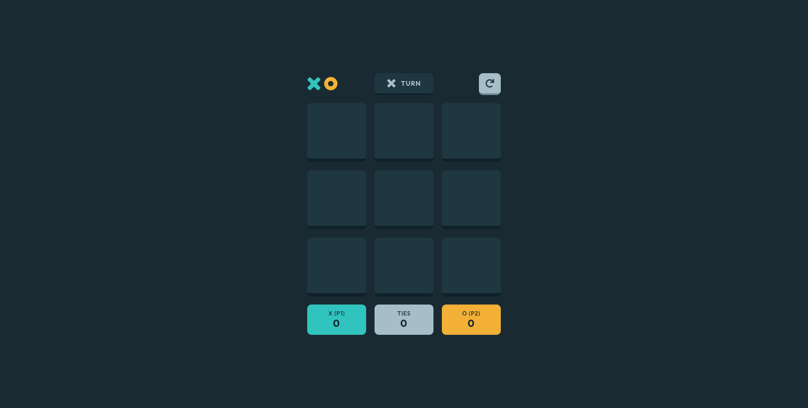
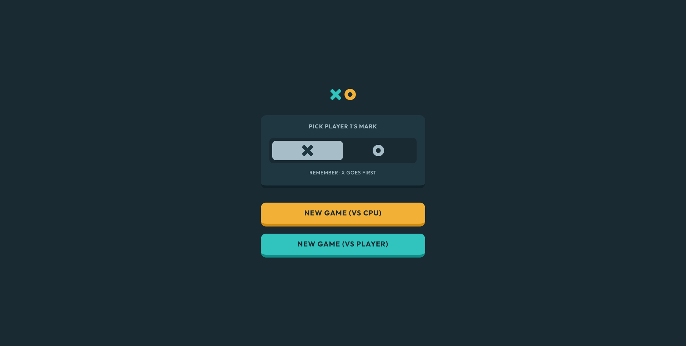
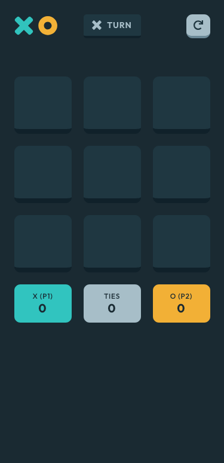

# Frontend Mentor - Tic Tac Toe solution

This is a solution to the [Tic Tac Toe challenge on Frontend Mentor](https://www.frontendmentor.io/challenges/tic-tac-toe-game-Re7ZF_E2v). Frontend Mentor challenges help you improve your coding skills by building realistic projects.

## Table of contents

- [Overview](#overview)
  - [The challenge](#the-challenge)
  - [Screenshot](#screenshot)
  - [Links](#links)
- [My process](#my-process)
  - [Built with](#built-with)
  - [What I learned](#what-i-learned)
  - [Useful resources](#useful-resources)
- [Author](#author)

## Overview

### The challenge

Users should be able to:

- View the optimal layout for the game depending on their device's screen size
- See hover states for all interactive elements on the page
- Play the game either solo vs the computer or multiplayer against another person
- **Bonus 1**: Save the game state in the browser so that it’s preserved if the player refreshes their browser
- **Bonus 2**: Instead of having the computer randomly make their moves, try making it clever so it’s proactive in blocking your moves and trying to win

### Screenshot





### Links

- Solution URL: [https://github.com/srijanss/tic-tac-toe-game](https://github.com/srijanss/tic-tac-toe-game)
- Live Site URL: [https://srijanss.github.io/tic-tac-toe-game/](https://srijanss.github.io/tic-tac-toe-game/)

## My process

### Built with

- Semantic HTML5 markup
- CSS custom properties
- Flexbox
- CSS Grid
- Mobile-first workflow
- [Vite](https://vitejs.dev/) - Lightweight frontend tooling
- [PostCSS](https://postcss.org/) - Tool to transform CSS using plugins

### What I learned

- I learned new aria roles and attributes to make the game accessible, like grid, gridcell etc.
- I learned how to use aria-live attribute to make the player turn live for screen readers.

```html
<div class="game-board">
  <header-component showTurn="true" showRestartButton="true"></header-component>
  <main>
    <section class="grid" aria-label="Tic tac toe grid" role="grid"></section>
    <span class="visually-hidden" id="instructions"
      >Press Space or Enter to place your mark</span
    >
  </main>
  <footer-component></footer-component>
</div>
```

- I learned how to use CSS :not() pseudo-class to style the cells that are not occupied by a mark.
- I learned how to use CSS :hover and :focus pseudo-classes to style the cells when hovered or focused.
- I learned how to use CSS :before pseudo-element to add an icon to the cells when hovered or focused.
- I learned how to use CSS variables to set the icon size and position.

```css
&[data-activemark="x"]:not(.cell-occupied):hover,
&[data-activemark="x"]:not(.cell-occupied):focus {
  position: relative;
  &:before {
    content: "";
    width: var(--icon-size);
    height: var(--icon-size);
    position: absolute;
    top: calc(50% - var(--icon-size) / 2);
    left: calc(50% - var(--icon-size) / 2);
    display: block;
    background: url("../../../images/icon-x-outline.svg") no-repeat center
      center / contain;
  }
}

&[data-activemark="o"]:not(.cell-occupied):hover,
&[data-activemark="o"]:not(.cell-occupied):focus {
  position: relative;
  &:before {
    content: "";
    width: var(--icon-size);
    height: var(--icon-size);
    position: absolute;
    top: calc(50% - var(--icon-size) / 2);
    left: calc(50% - var(--icon-size) / 2);
    display: block;
    background: url("../../../images/icon-o-outline.svg") no-repeat center
      center / contain;
  }
}
```

- I learned how to use aria-label attribute to provide a label for the grid cells.
- I learned how to use aria-describedby attribute to associate the instructions with the grid cells.
- I learned how to change cell state using data attributes.
- I learned how to use Javascript's map method to render the cells.

```js
renderCells() {
  return `
    ${Store.gameBoard
      .map((cell, index) => {
        return `<button class="grid-cell ${
          cell !== " " ? "cell-occupied" : ""
        } ${
          Store.winningCombination.includes(index) ? "winning-cell" : ""
        }" data-activemark=${
          cell === " " ? Store.activeMark : cell
        } data-index="${index}" role="gridcell" aria-label="Cell ${index}" aria-describedby="${
          cell === " " ? "instructions" : ""
        }">
          <span id="cell-status-${index}" class="visually-hidden">
            ${
              cell !== " "
                ? "Cell " + index + ", filled with mark " + cell
                : "Cell " + index + ", empty"
            }
          </span>
        </button>`;
      })
      .join("")}
  `;
}
```

- I separated the game logic and data store from the UI components to make the code more modular and maintainable.
- I learned how to use Javascript's every method to check if the game is a tie.
- I learned how to use Javascript's filter method to filter the cells that match the active mark.
- I learned how to use Math functions to generate a random number.

```js
getCpuMove() {
  const opponentMark =
    this.activeMark === this.MARK.X ? this.MARK.O : this.MARK.X;
  const gameLogic = new GameLogic(
    this.gameBoard,
    this.activeMark,
    opponentMark
  );
  return gameLogic.getCpuMove();
}

checkTie() {
    return this.gameBoard.every((cell) => cell !== " ");
  }

cpuRandomMove(emptyCells) {
  return emptyCells[Math.floor(Math.random() * emptyCells.length)];
}

getWinCombinationCount(marker) {
  let count = 0;
  this.winningCombinations.forEach((combination) => {
    const [a, b, c] = combination;
    const markerMatch = [a, b, c].filter(
      (cell) => this.gameBoard[cell] === marker
    );
    if (markerMatch.length !== 2) return;
    count++;
  });
  return count;
}
```

### Useful resources

- [Web Components](https://developer.mozilla.org/en-US/docs/Web/API/Web_components/Using_custom_elements)
- [Accessibility ARIA](https://developer.mozilla.org/en-US/docs/Web/Accessibility/ARIA)

## Author

- Website - [Srijan Manandhar](https://github.com/srijanss)
- Frontend Mentor - [@srijanss](https://www.frontendmentor.io/profile/srijanss)
